build-lists: true
autoscale: true

## Azat Mardan
### All Things Open 2018

---

# About Me

* Eng. Leader @ Indeed, World's #1 Job Search Site
* Live in San Fancisco Bay Area
* Book and course author
* Paleo lifestyle enthusiast
* Microsoft Most Valuable Professional
* ex-Tech Fellow @ Capital One

---

## 239 most active GitHub contributor

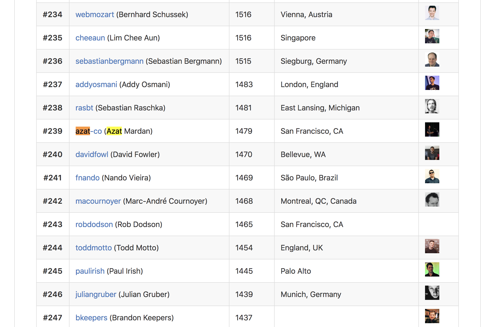

^http://bit.ly/2PMa26I

---

## Why bother?

---

## Written communication is everywhere

* Slack, IM, Google Chat, Skype
* Wiki, Confluence, GitHub
* Emails
* Blog posts
* Books

---

## 5 reasons writing will only grow

* Precise
* Cheap
* Asynchronous
* Removes bias
* Fast to consume

---

## 5 benefits of tech writing

* Clears your thoughts
* Scalable communication and teaching
* Documentation for future
* Extra income
* Prestige

---

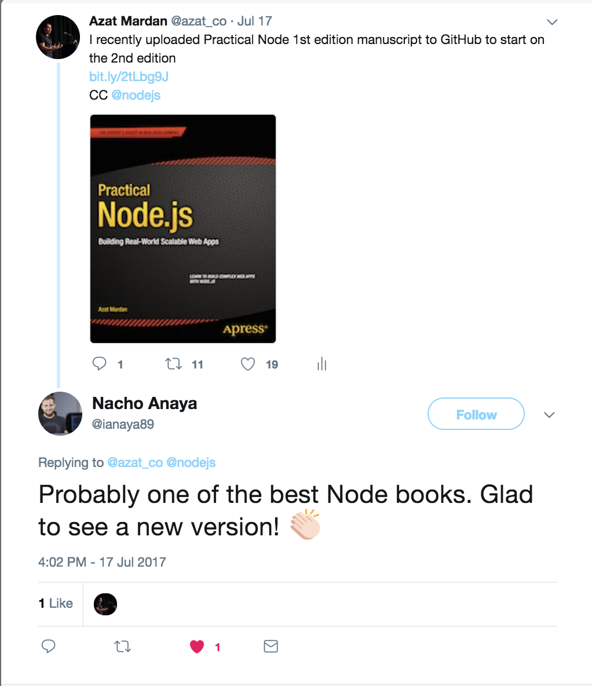

---

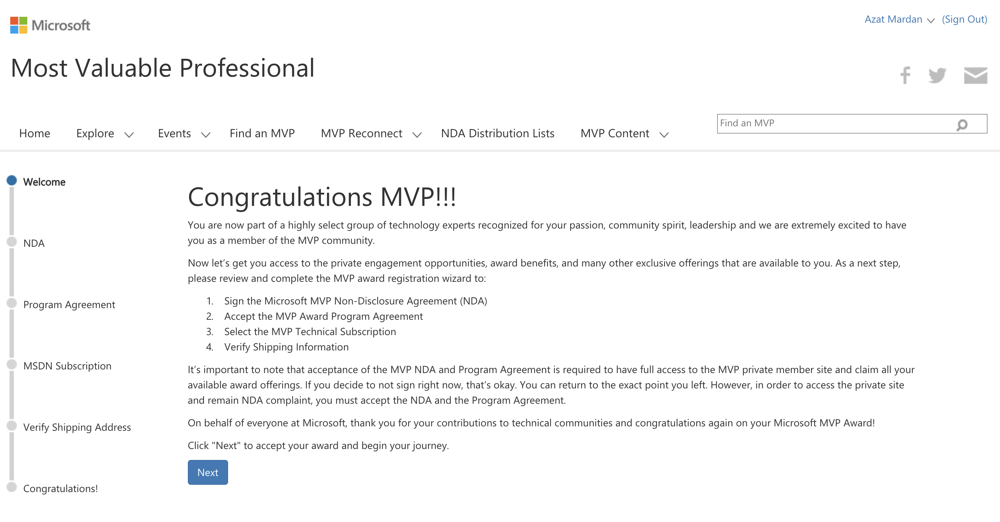

---

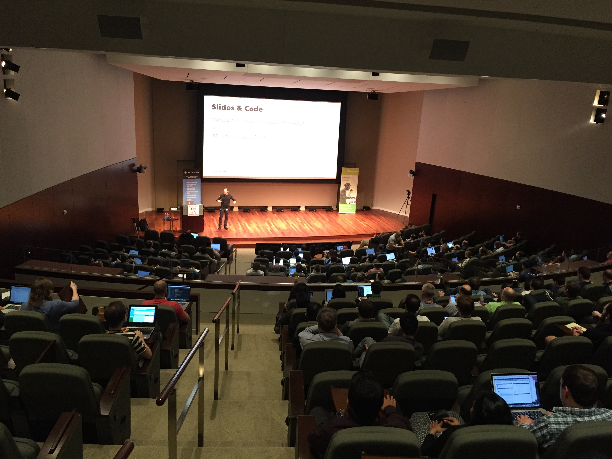

---

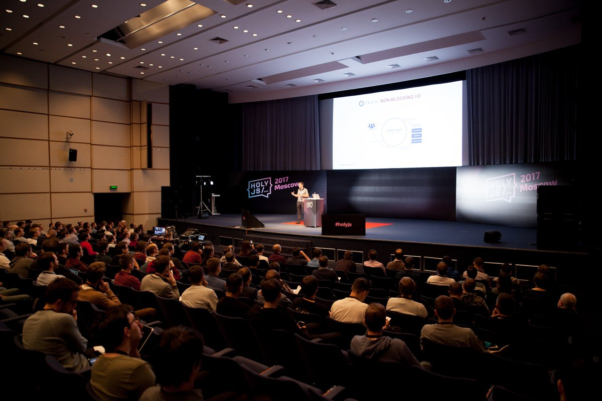

---

## Who would like to make $300-1000 extra for a few hours of work (at your own schedule)?

---

# My Story

* Grew webapplog.com from 20 to 2000 visits/day
* Wrote 200+ posts
* Wrote for Microsoft, edX, StrongLoop (IBM) and others

---

## Common obstacles

* I don't have time
* I don't know anything interesting
* I am scared of negative comments
* I don't know where to start

---

## 7 Steps to Writing a Blog Post

1. Come up with a topic
2. Write an outline
3. Iterate on the outline
4. Write the post
5. Iterate on the post
6. Publish
7. Engage with the audience

---

## Tips to come up with a topic

* Conferences
* Newsletter
* Water-cooler convos
* Your work
* Things you want to know more about

---

# My Story

* Not a native English speaker
* Terrible at typos (speed read)
* Didn't blog about ground-breaking things

---

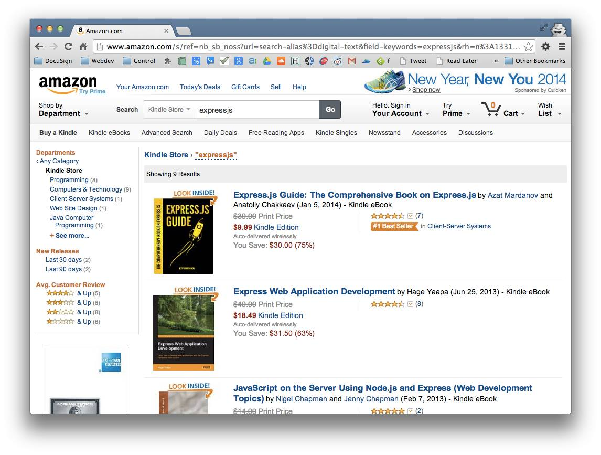

---

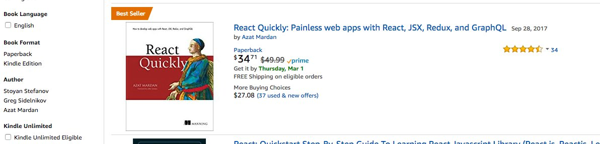

---

# My Story (Cont.)

* 18 Books
* Lots of top-sellers and Amazon best-sellers
* Speaking and consulting gigs all over the world
* Wrote first books in 2002

---

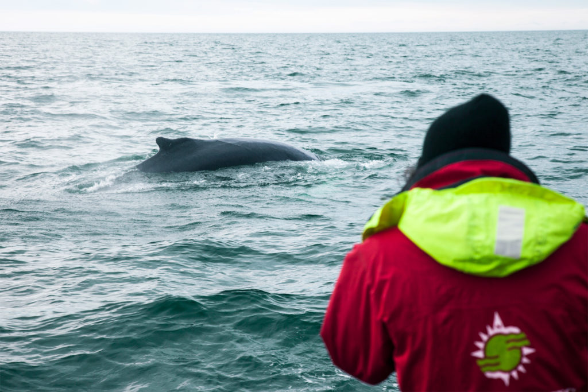

---

---

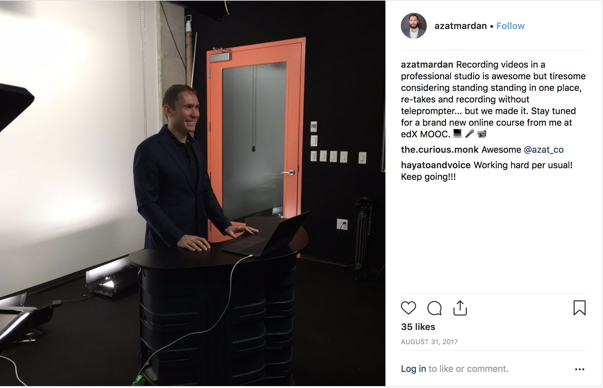

---

# Writing books

---

# Two way to publish a book

* Self-publishing: Leanpub, Pandoc, Amazon KDP
* Traditional publishing: Apress, Manning, Wiley

---

# Would you like to be paid while you sleep?

---

---

## 10 Steps to writing a book

1. Decide why you want to do it
2. Come up with 2-3 topics
3. Write blog posts to validate
4. Presell or write&submit proposals to validate
5. Start writing
6. Hire tech & copy editing
7. Review
8. Publish
9. Update
10. Repeat

---

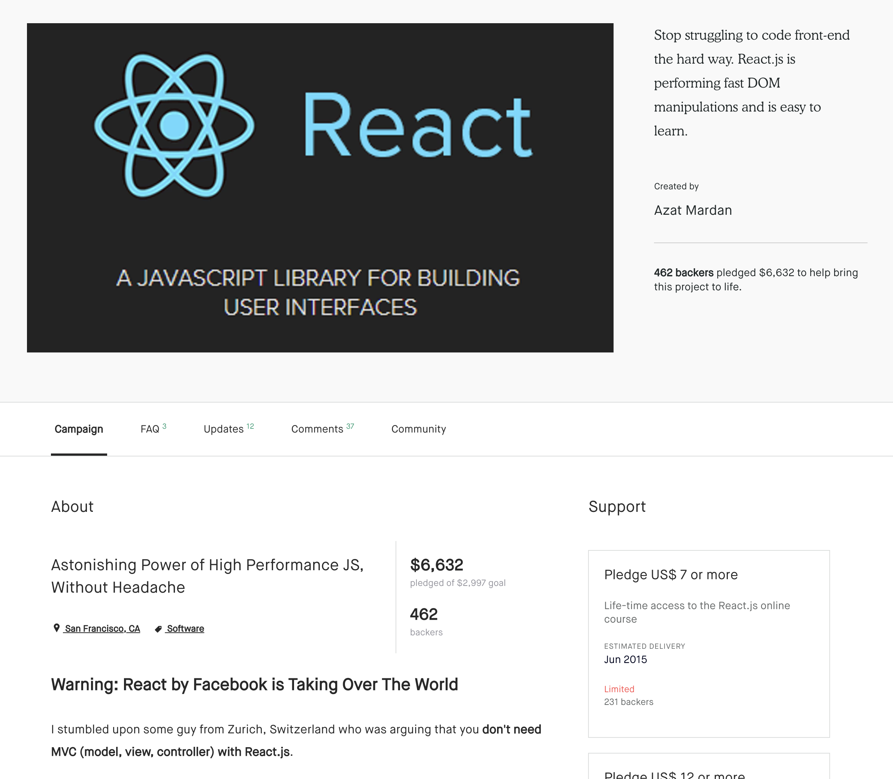

---

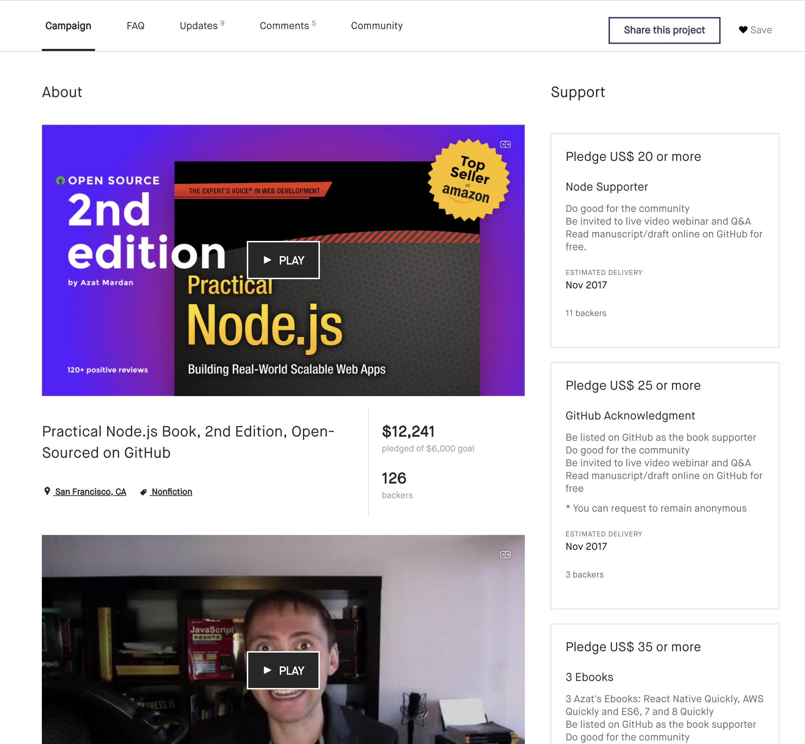

---

## What's need to be in a book proposal

* Detailed outline
* Target audience
* About author
* Keywords
* Pre-requisites
* Sample chapter
* Competitors

---

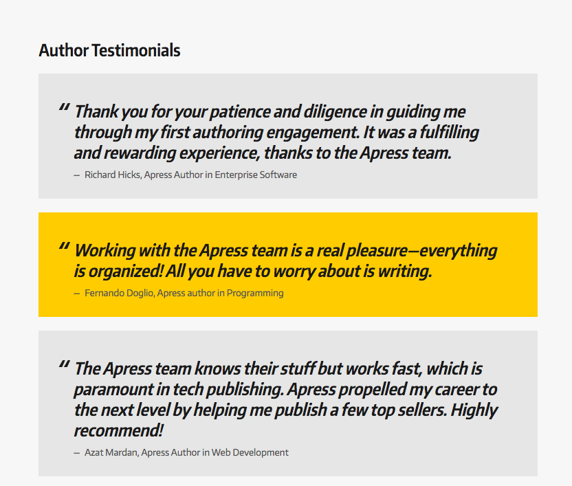

<https://www.apress.com/us/write-for-us>

---

## This lecture is not a rocket science.

---

Most of your will never become good writers or publish anything substantial or publish long enough to give yourself a chance to become better.

---

## Why most people never follow through?

* Afraid of a failure
* Lack of accountability
* Too much comfort and not enough whys
* Cannot break down large tasks into smaller
* Try to finish everything at once

---

## Home work

* Write about ATO 2018
* Find a topic for another blog post or a book
* Find a mentor and coach

---

---

## Further study

* *Write Your Way to Success*
* *Make money online with your webskills*
* Find a coach

